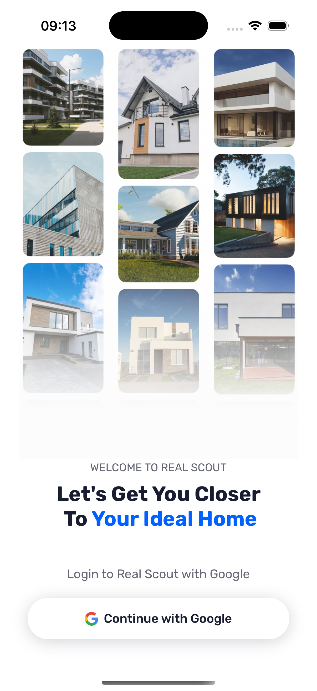
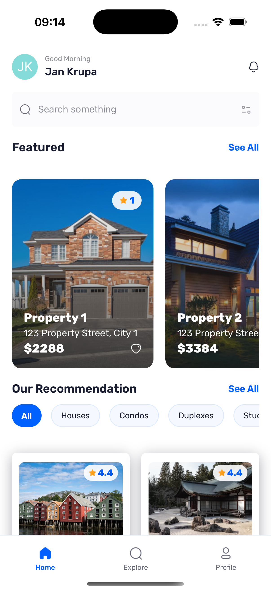
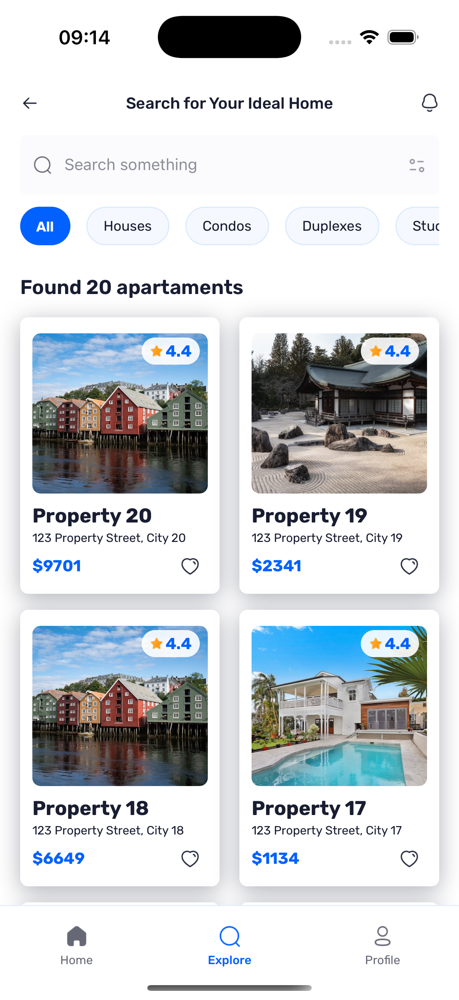
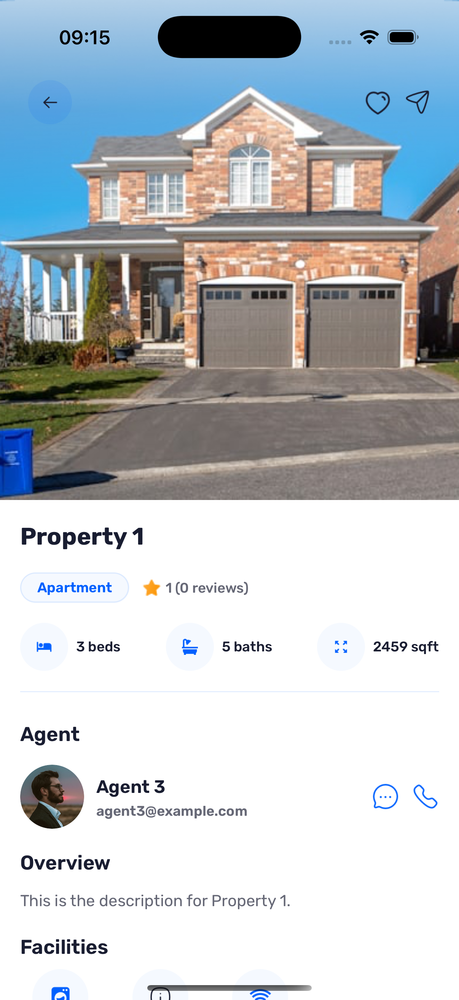

# 🏡 Real Estate Mobile App

Discover, explore and manage properties seamlessly across iOS and Android.  
This mobile app is built with **React Native (Expo)** and powered by **Appwrite** for authentication, data and file storage.

---

## ✨ Features

- 🔑 **Google OAuth2 Authentication** via Appwrite
- 👤 **User Context & Global State** with React Context API
- 🏠 **Property Listings**
    - Browse latest properties
    - Search by name, address, or type
    - Filter by category (Apartment, House, etc.)
- ⭐ **Reviews & Ratings** per property
- 🧑‍💼 **Agent Profiles** linked to properties
- 🖼 **Property Galleries** with images
- ☁️ **Appwrite Backend**
    - Database (properties, agents, reviews, galleries)
    - Storage bucket for images
    - Avatars API for initials

---

## 🛠 Tech Stack

- [React Native](https://reactnative.dev/) (Expo)
- [Expo Router](https://expo.github.io/router/)
- [TypeScript](https://www.typescriptlang.org/)
- [Appwrite](https://appwrite.io/) (Auth, Database, Storage, Avatars)
- [NativeWind](https://www.nativewind.dev/) (Tailwind CSS for RN)
- [use-debounce](https://www.npmjs.com/package/use-debounce) for optimized search

---

## 🚀 Getting Started

### Prerequisites

- Node.js >= 18
- npm or yarn
- Expo CLI (`npm install -g expo-cli`)
- Appwrite instance (self-hosted or [Cloud](https://cloud.appwrite.io))

### Installation

1. Clone the repo:

    ```bash
    git clone https://github.com/<your-username>/real-estate-app.git
    cd real-estate-app

    ```

2. Install dependencies

    ```bash
    npm install

    ```

3. Run the project
    ```bash
    run
    ```

### Screenshots

<p float="left">
  
  
  
</p>

<p float="left">
  
  
</p>
